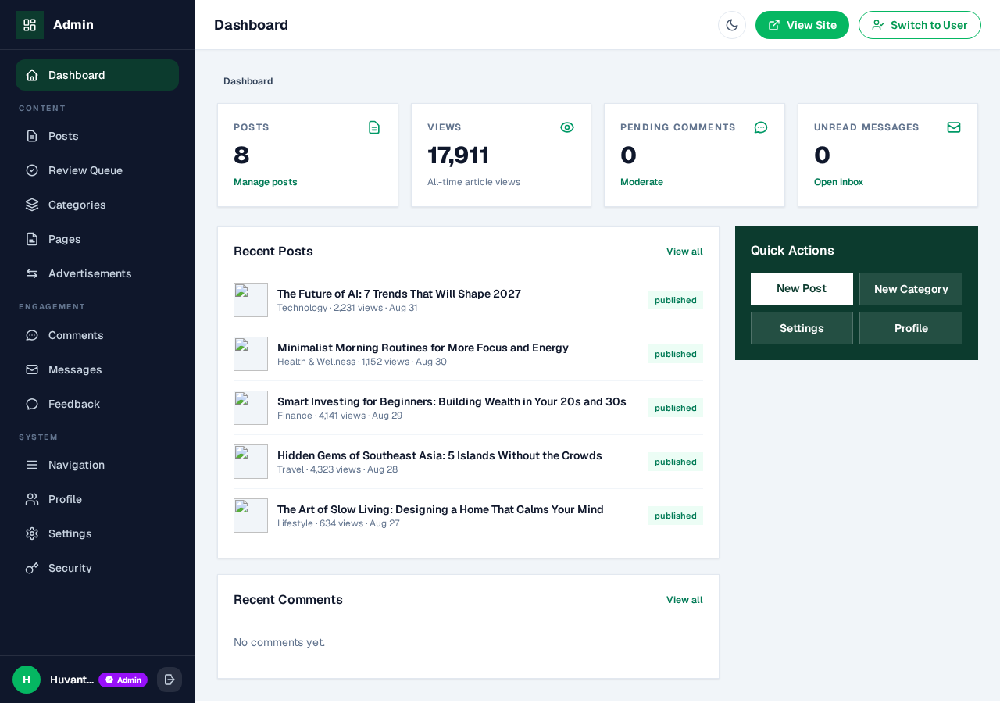

<div align="center">

# Huvanti — Open-Source Laravel Blog CMS

**A production-ready, multi-niche blogging platform built with Laravel, Tailwind CSS 4 and a complete admin + author panel — with built-in SEO scoring, instant search indexing and automatic social media publishing.**

[](https://huvanti.com)
[](LICENSE)


**[huvanti.com](https://huvanti.com) · [Explore Ideas. Inspire Life.](https://huvanti.com)**

</div>

---

Huvanti is a free, self-hosted publishing platform: a fast multi-author blog front-end, a full admin CMS, an author dashboard with a review workflow, and a built-in SEO toolkit — **live SEO scoring, instant search-engine indexing and automatic social media publishing** — everything a modern blog needs in one Laravel app.

|  |
|:---:|
| *The [Huvanti blog](https://huvanti.com) front page — Tailwind CSS 4, light/dark mode* |

## Highlights

- **Write & publish fast** — custom dependency-free rich-text editor with autosave, FAQ builder, scheduling, featured-image auto-optimisation
- **Rank higher** — live RankMath-style SEO score (0–100) in the editor, focus-keyword analysis, IndexNow instant indexing, sitemap, schema, canonical URLs
- **Grow on autopilot** — publish once and Huvanti shares the post to X, Facebook, LinkedIn, Instagram, Telegram and Pinterest automatically
- **AI-assisted writing** — bring your own key (NVIDIA NIM free tier, Groq, OpenRouter, OpenAI); one-click titles, descriptions, keywords, excerpts and FAQs with automatic model failover
- **Two panels, one design system** — a full admin CMS and a clean author dashboard with draft → review → publish workflow

## Screenshots

| Article page | Admin CMS |
|:---:|:---:|
|  |  |

## Features

### Writing & Editing
- Rich-text post editor (custom, dependency-free) with autosave and crash recovery
- FAQ builder per post, featured image upload (auto WebP conversion), URL slugs, scheduling
- Author workflow: draft → submit → admin review → publish, with returned-post notes and resubmission
- Role-aware panels: full admin CMS + a clean author dashboard

### SEO Toolkit (built in)
- **Live SEO score (0–100)** while writing — focus keyword placement, keyword density, title/meta lengths, word count, subheadings, internal/external links, image alt text (mirrored server-side and persisted per post)
- **Instant indexing** — IndexNow pings to Bing, Yandex, Seznam & Naver on every publish/update/delete, plus manual one-click "Index now" buttons (single + bulk) for admins and authors
- Auto-generated `sitemap.xml`, `robots.txt`, `ads.txt`, `llms.txt`, canonical URLs, Open Graph/Twitter meta, Table of Contents, reading time, FAQ schema
- Google Search Console / Bing / GTM / GA4 / Ahrefs verification fields in the admin panel

### Social Media Automation (admin panel)
- Publish a post and it is **automatically shared to X (Twitter), Facebook Pages, LinkedIn, Instagram, Telegram and Pinterest**
- Per-network credentials, one-click "Test connection", delivery log with retries, custom message template with `{title}` `{url}` `{site}` placeholders
- Post-publish share screen: copyable post URL + share buttons (Facebook, X, LinkedIn, WhatsApp, Telegram, Reddit, Pinterest, Email)

### AI Writing Assistant (admin-configured)
- Bring your own key: **NVIDIA NIM (free), Groq, OpenRouter, OpenAI** — any OpenAI-compatible API
- One-click meta titles, meta descriptions, focus keywords, excerpts and FAQ suggestions + free-form "Ask AI" inside the editor
- **Automatic model failover**: list several models; if one is busy or rate-limited the next takes over
- Keys are AES-256-GCM encrypted at rest, never exposed to browsers, with per-user daily limits

### CMS & Site Management
- Dashboard stats, posts CRUD with bulk actions + trash, categories (drag & drop), pages, navigation manager, comment moderation, contact inbox, feedback, ads manager
- Site settings: fonts, hero section, colors, dark mode (light/dark toggle across site + panels)
- Security: bcrypt, TOTP 2FA, CSRF protection, encrypted secrets, session hardening

## Tech Stack

| Layer | Technology |
|---|---|
| Backend | Laravel 13 (PHP 8.3+), MySQL / SQLite |
| Frontend | Tailwind CSS 4, Vite 8, vanilla JS modules |
| Editor | Custom rich-text editor (zero dependencies) |
| SEO | IndexNow, sitemap, schema, live analyzer |
| AI | NVIDIA NIM / Groq / OpenRouter / OpenAI (OpenAI-compatible) |
| Hosting | Deployable to shared hosting (Hostinger) out of the box |

## Quick Start

```bash
git clone https://github.com/pritamsarkar711/project15.git huvanti
cd huvanti
composer install
cp .env.example .env && php artisan key:generate
touch database/database.sqlite
php artisan migrate --seed
php artisan storage:link
npm install && npm run build
php artisan serve
# Site: http://localhost:8000 · Admin sign-in: http://localhost:8000/manage/login
```

## Deployment

See **[HOSTINGER_DEPLOYMENT.md](HOSTINGER_DEPLOYMENT.md)** — the repo is tuned for Hostinger Git auto-deploy (vendored `vendor/`, committed build assets, no composer/npm on the server). Every push deploys automatically.

## Security & Privacy

See **[SECURITY.md](SECURITY.md)**. Short version:

- No `.env`, no database, no credentials, no API keys are committed — ever
- Runtime secrets (SMTP, social tokens, AI keys) are **AES-256-GCM encrypted at rest** and masked in the UI
- Verification files under `public/` (IndexNow, Search Console) are public by design and grant no access

## Who uses Huvanti?

[Huvanti](https://huvanti.com) — an independent digital publication covering technology, wellness, finance, travel, lifestyle and education — runs on this platform in production every day. Every article on [huvanti.com](https://huvanti.com) is written, reviewed, scored for SEO, indexed and social-shared through this codebase.

## Structure

```
app/                    Laravel application (Models, Http/Controllers, Services, Support)
├── Services/Ai/        AI assistant (multi-provider, model failover)
├── Services/Social/    Social auto-post (X, Facebook, LinkedIn, Instagram, Telegram, Pinterest)
└── Services/           SeoAnalyzer, IndexNow, and more
resources/views/
├── admin/              Admin CMS (dashboard, posts, settings, social, AI)
├── frontend/           Public site + author dashboard
└── partials/           Shared components (SEO/AI panel, share buttons)
public/js/              seo-analyzer.js · ai-assistant.js · huvanti-editor.js
routes/web.php          All routes (frontend + panels)
```

## Contributing

Bug reports and pull requests are welcome. For major changes, open an issue first to discuss what you would like to change.

## License

Released under the [MIT License](LICENSE).

Built and maintained for [Huvanti](https://huvanti.com) — **[huvanti.com](https://huvanti.com)** · Explore Ideas. Inspire Life.
